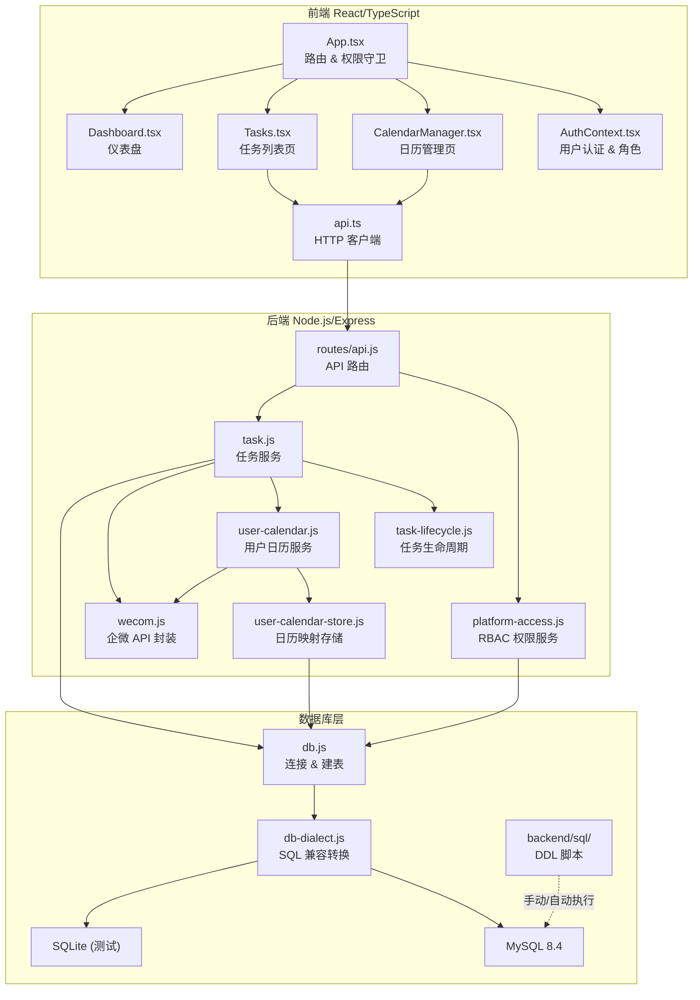
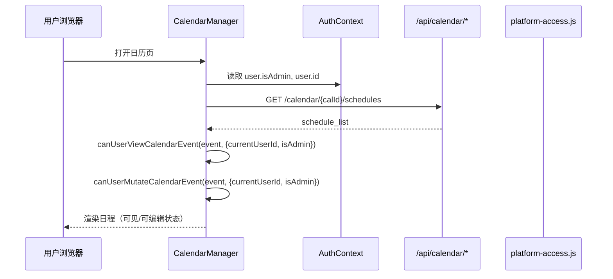

# 技术设计文档

## 概述

本设计文档覆盖企业微信任务管理系统的三项核心增强：

1. **MySQL DDL 脚本化部署**：将现有 `init-mysql.js` 中的程序化建表逻辑提取为标准 `.sql` 文件，支持 DBA 直接审阅和 MySQL 客户端手动执行，同时保留 `npm run db:init:mysql` 自动化入口。
2. **基于角色的日程权限控制（RBAC）**：在已有 `platform-access.js` 三层角色模型（SUPER_ADMIN / ADMIN / EXECUTOR）基础上，为日历页面实现分级查看与编辑权限，并完善日程到期提醒链路。
3. **前端体验优化**：融合华书设计哲学（#[[file:.kiro/steering/huashu-design.md]]），对日历管理页和全局 CRUD 操作进行响应式适配、乐观更新、视觉层级优化和反 AI slop 治理。

### 设计决策与理由

| 决策 | 理由 |
|------|------|
| SQL 脚本放在 `backend/sql/` 而非嵌入 JS | DBA 可直接 `mysql < file.sql` 执行，降低运维门槛 |
| 权限判定复用 `canUserViewCalendarEvent` / `canUserMutateCalendarEvent` | CalendarManager.tsx 已有这两个函数，只需确保前端正确传入 `isAdmin` |
| 乐观更新 + 服务端回查 | 华书哲学要求「操作反馈即时」，回查保证最终一致性 |
| 视觉层级区分权限而非弹窗阻断 | 华书哲学明确要求「通过视觉层级体现不同角色的操作边界」 |
| 使用 `prefers-reduced-motion` 媒体查询 | 无障碍合规，尊重用户偏好 |

## 架构

### 系统架构总览



### 数据流：日程权限判定



## 组件与接口

### 1. SQL DDL 脚本模块

**文件结构：**
```
backend/sql/
├── 001-create-database.sql    # 建库
├── 002-create-tables.sql      # 全部建表
└── 003-migrations.sql         # 字段迁移（幂等）
```

**`init-mysql.js` 改造接口：**
```javascript
// 新增：按编号顺序读取 backend/sql/*.sql 并逐条执行
async function executeSqlFiles(pool, sqlDir) → void
// 保留：连接配置从 db-dialect.js 读取
```

**设计决策：** `init-mysql.js` 改为读取 `.sql` 文件而非调用 `db.js` 的 `initializeSchema()`。这样 `.sql` 文件既可被脚本自动执行，也可被 DBA 手动执行，且可挂载到 Docker `/docker-entrypoint-initdb.d/`。

### 2. 数据库兼容层增强

**`db-dialect.js` 现有接口保持不变：**
- `transformSqlForClient(sql, clientName)` — 已支持 `datetime('now')` → `CURRENT_TIMESTAMP`、`ON CONFLICT` → `ON DUPLICATE KEY UPDATE` 等转换
- `buildSchemaStatements(clientName)` — 已按客户端输出完整建表语句
- `buildMysqlConnectionConfig(env)` — 已从环境变量读取连接参数

**需补充的转换规则：**
- `datetime('now', '+N hour')` → `DATE_ADD(CURRENT_TIMESTAMP, INTERVAL N HOUR)` — 已实现
- `datetime('now', '-N hour')` → `DATE_SUB(CURRENT_TIMESTAMP, INTERVAL N HOUR)` — 已实现
- `datetime(?, 'unixepoch')` → `FROM_UNIXTIME(?)` — 已实现

经代码审查，`transformSqlForClient` 已覆盖需求 8 的全部转换规则。本次设计重点确保 `.sql` 脚本与 `buildSchemaStatements('mysql')` 输出的表结构完全一致。

### 3. 日程权限控制组件

**前端权限判定（CalendarManager.tsx 已有）：**

```typescript
// 已存在，无需新增
canUserViewCalendarEvent(event, { currentUserId, isAdmin }) → boolean
canUserMutateCalendarEvent(event, { currentUserId, isAdmin }) → boolean
```

**权限矩阵：**

| 操作 | SUPER_ADMIN | ADMIN | EXECUTOR |
|------|:-----------:|:-----:|:--------:|
| 查看所有日程 | ✅ | ✅ | ❌ |
| 查看自己相关日程 | ✅ | ✅ | ✅ |
| 编辑任意日程 | ✅ | ✅ | ❌ |
| 编辑自己创建的日程 | ✅ | ✅ | ✅ |
| 删除任意日程 | ✅ | ✅ | ❌ |
| 删除自己创建的日程 | ✅ | ✅ | ✅ |

**后端权限接口（platform-access.js 已有）：**
- `getEffectivePlatformAccess(userId)` → `{ platform_role, is_admin, is_super_admin, menu_permissions }`
- 登录时通过 `/api/user/me` 返回，前端存入 `AuthContext`

### 4. 日程提醒服务

**复用现有模块：**
- `task-lifecycle.js` 的 `getReminderKind(task, now)` — 判定提醒类型
- `task-lifecycle.js` 的 `shouldSendReminder(task, reminderKind, now, cooldownHours)` — 冷却期判定
- `task.js` 的 `dispatchTaskReminder(task, source, now)` — 发送提醒并回写状态

**定时任务（sync.js 已有 cron）：**
- 周期性调用 `listPendingTasks()` → 逐条 `dispatchTaskReminder()`
- 冷却期默认 12 小时，通过 `shouldSendReminder` 控制

### 5. 前端日历页面优化组件

**新增/改造的 UI 模式：**

| 组件 | 桌面端（≥1024px） | 平板端（768-1023px） | 移动端（<768px） |
|------|-------------------|---------------------|-----------------|
| 创建表单 | 居中 Modal（max-w-640px） | 侧边 Drawer | 全屏底部 Drawer |
| 编辑表单 | 行内编辑 / Modal | 侧边 Drawer | 全屏底部 Drawer |
| 删除确认 | Popconfirm 气泡 | Popconfirm 气泡 | 底部 Action Sheet |
| 月视图 | 标准 6×7 网格 | 标准 6×7 网格 | 紧凑列表/周视图 |
| 操作反馈 | Toast（底部滑入，2s） | Toast | Toast |

**华书设计哲学应用：**

- **视觉温度**：冷静 + 权威，企业微信蓝 `#1890ff` 作为唯一 accent
- **信息密度**：高密度型（数据/效率工具），每屏至少 3 处产品差异化信息
- **权限视觉化**：EXECUTOR 查看他人日程时，编辑/删除按钮通过 `opacity-40 pointer-events-none` 弱化而非弹窗阻断
- **日程区分**：自己创建的日程使用 `border-l-4 border-blue-500` 左侧色条 + 较深字重；他人分配的日程使用 `border-l-4 border-slate-300` + 较浅字重
- **反 AI slop**：禁止 emoji 图标、紫色渐变、编造统计数据、散落微交互动画
- **Skeleton Screen**：API 加载中使用骨架屏而非 spinner，保持布局稳定
- **`prefers-reduced-motion`**：所有过渡动画包裹在 `@media (prefers-reduced-motion: no-preference)` 中


## 数据模型

### 现有表结构（MySQL DDL 脚本需覆盖）

以下 7 张表已在 `db-dialect.js` 的 `buildSchemaStatements('mysql')` 中定义，`.sql` 脚本需与之完全一致：

#### tasks 表

```sql
CREATE TABLE IF NOT EXISTS tasks (
  id BIGINT NOT NULL AUTO_INCREMENT PRIMARY KEY,
  wecom_schedule_id VARCHAR(191) UNIQUE,
  title TEXT,
  description TEXT,
  creator_userid VARCHAR(191),
  executor_userid VARCHAR(191),
  owner_userid VARCHAR(191),
  owner_cal_id VARCHAR(191),
  start_time DATETIME,
  end_time DATETIME,
  status VARCHAR(32) DEFAULT 'PENDING',
  completion_time DATETIME,
  verify_time DATETIME,
  reject_reason TEXT,
  redo_count INT DEFAULT 0,
  last_reminder_at DATETIME,
  last_reminder_kind VARCHAR(64),
  completed_by_userid VARCHAR(191),
  verified_by_userid VARCHAR(191),
  updated_at DATETIME DEFAULT CURRENT_TIMESTAMP,
  created_at DATETIME DEFAULT CURRENT_TIMESTAMP
) ENGINE=InnoDB DEFAULT CHARSET=utf8mb4 COLLATE=utf8mb4_unicode_ci;
```

#### user_calendar_map 表

```sql
CREATE TABLE IF NOT EXISTS user_calendar_map (
  user_id VARCHAR(191) PRIMARY KEY,
  cal_id VARCHAR(191) NOT NULL,
  calendar_summary VARCHAR(255),
  source VARCHAR(64) DEFAULT 'auto_created',
  updated_at DATETIME DEFAULT CURRENT_TIMESTAMP,
  created_at DATETIME DEFAULT CURRENT_TIMESTAMP
) ENGINE=InnoDB DEFAULT CHARSET=utf8mb4 COLLATE=utf8mb4_unicode_ci;
```

#### platform_user_access 表

```sql
CREATE TABLE IF NOT EXISTS platform_user_access (
  user_id VARCHAR(191) PRIMARY KEY,
  platform_role VARCHAR(32) NOT NULL,
  menu_permissions_json VARCHAR(2048) DEFAULT '[]',
  updated_by_userid VARCHAR(191),
  updated_at DATETIME DEFAULT CURRENT_TIMESTAMP,
  created_at DATETIME DEFAULT CURRENT_TIMESTAMP
) ENGINE=InnoDB DEFAULT CHARSET=utf8mb4 COLLATE=utf8mb4_unicode_ci;
```

#### wecom_contact_users 表

```sql
CREATE TABLE IF NOT EXISTS wecom_contact_users (
  user_id VARCHAR(191) PRIMARY KEY,
  name VARCHAR(191),
  department_ids_json VARCHAR(2048) DEFAULT '[]',
  main_department INT,
  is_leader_in_dept_json VARCHAR(2048) DEFAULT '[]',
  direct_leader_user_ids_json VARCHAR(2048) DEFAULT '[]',
  position VARCHAR(191),
  mobile VARCHAR(64),
  gender INT,
  email VARCHAR(191),
  biz_mail VARCHAR(191),
  status INT,
  avatar TEXT,
  telephone VARCHAR(64),
  address VARCHAR(255),
  alias VARCHAR(191),
  qr_code TEXT,
  updated_at DATETIME DEFAULT CURRENT_TIMESTAMP,
  created_at DATETIME DEFAULT CURRENT_TIMESTAMP
) ENGINE=InnoDB DEFAULT CHARSET=utf8mb4 COLLATE=utf8mb4_unicode_ci;
```

#### wecom_contact_departments 表

```sql
CREATE TABLE IF NOT EXISTS wecom_contact_departments (
  department_id INT PRIMARY KEY,
  name VARCHAR(191),
  parent_department_id INT,
  order_value INT,
  updated_at DATETIME DEFAULT CURRENT_TIMESTAMP,
  created_at DATETIME DEFAULT CURRENT_TIMESTAMP
) ENGINE=InnoDB DEFAULT CHARSET=utf8mb4 COLLATE=utf8mb4_unicode_ci;
```

#### wecom_contact_tags 表

```sql
CREATE TABLE IF NOT EXISTS wecom_contact_tags (
  tag_id INT PRIMARY KEY,
  name VARCHAR(191),
  add_user_items_json VARCHAR(2048) DEFAULT '[]',
  del_user_items_json VARCHAR(2048) DEFAULT '[]',
  add_party_items_json VARCHAR(2048) DEFAULT '[]',
  del_party_items_json VARCHAR(2048) DEFAULT '[]',
  updated_at DATETIME DEFAULT CURRENT_TIMESTAMP,
  created_at DATETIME DEFAULT CURRENT_TIMESTAMP
) ENGINE=InnoDB DEFAULT CHARSET=utf8mb4 COLLATE=utf8mb4_unicode_ci;
```

#### wecom_contact_event_log 表

```sql
CREATE TABLE IF NOT EXISTS wecom_contact_event_log (
  id BIGINT NOT NULL AUTO_INCREMENT PRIMARY KEY,
  change_type VARCHAR(64) NOT NULL,
  entity_type VARCHAR(64) NOT NULL,
  entity_id VARCHAR(191) NOT NULL,
  payload_json LONGTEXT NOT NULL,
  created_at DATETIME DEFAULT CURRENT_TIMESTAMP
) ENGINE=InnoDB DEFAULT CHARSET=utf8mb4 COLLATE=utf8mb4_unicode_ci;
```

### 迁移字段（003-migrations.sql 需覆盖）

**tasks 表迁移列：**

| 列名 | 类型 | 默认值 | 说明 |
|------|------|--------|------|
| redo_count | INT | 0 | 驳回重做次数 |
| last_reminder_at | DATETIME | NULL | 最后提醒时间 |
| last_reminder_kind | VARCHAR(64) | NULL | 最后提醒类型 |
| completed_by_userid | VARCHAR(191) | NULL | 完成操作人 |
| verified_by_userid | VARCHAR(191) | NULL | 验收操作人 |
| updated_at | DATETIME | CURRENT_TIMESTAMP | 更新时间 |
| owner_cal_id | VARCHAR(191) | NULL | 归属日历 ID |
| owner_userid | VARCHAR(191) | NULL | 归属用户 ID |

**platform_user_access 表迁移列：**

| 列名 | 类型 | 默认值 | 说明 |
|------|------|--------|------|
| menu_permissions_json | VARCHAR(2048) | '[]' | 菜单权限 JSON |

### 前端数据模型

**CalendarBoardEvent（已存在于 CalendarManager.tsx）：**

```typescript
interface CalendarBoardEvent {
  id: string;           // schedule_id
  calId: string;        // 归属日历
  summary: string;      // 标题
  description: string;  // 描述
  location: string;     // 地点
  startTime: number;    // Unix 秒
  endTime: number;      // Unix 秒
  attendeesCount: number;
  attendeeUserIds: string[];
  ownerUserId: string;  // 创建者/组织者
  source: string;       // 数据来源标记
}
```

**User（AuthContext 提供）：**

```typescript
interface User {
  id: string;
  name: string;
  platformRole: 'SUPER_ADMIN' | 'ADMIN' | 'EXECUTOR';
  isAdmin: boolean;
  isSuperAdmin: boolean;
  menuPermissions: MenuPermission[];
}
```

