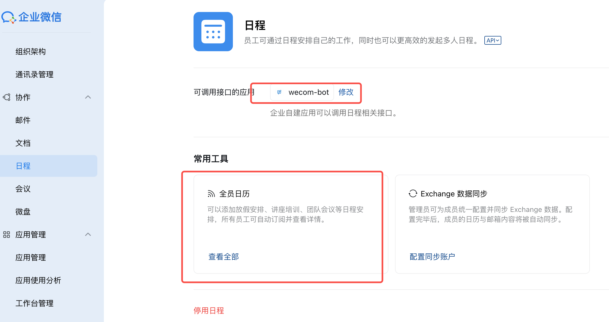

# 企业微信任务管家 — 新环境配置联调手册

> **适用版本**：当前主分支（以 `justin.yiyuehk.com` 为参考部署）
> **目标读者**：负责在新企业/新服务器上独立部署本系统的运维或开发人员

---

## 目录

1. [前置条件](#1-前置条件)
2. [企业微信后台配置](#2-企业微信后台配置)
3. [服务器环境变量配置](#3-服务器环境变量配置)
4. [部署与启动](#4-部署与启动)
5. [联调验证清单](#5-联调验证清单)
6. [常见问题排查](#6-常见问题排查)
7. [参数速查表](#7-参数速查表)

---

## 1. 前置条件

| 项目 | 要求 |
|------|------|
| 服务器 | Linux x86_64，推荐 Ubuntu 20.04+ / CentOS 7+ |
| Node.js | 18.x 或以上 |
| 对外域名 | 需要公网可访问的域名（企业微信要求 HTTP/HTTPS，**不支持纯 IP**） |
| 企业微信账号 | 企业管理员权限（需进入 [企业微信管理后台](https://work.weixin.qq.com/wework_admin/frame)） |
| 端口 | 默认监听 `80`，可改；若使用 Nginx 反代则需确保内部端口可用 |

---

## 2. 企业微信后台配置

> 入口：[企业微信管理后台](https://work.weixin.qq.com/wework_admin/frame)
> 本章所有操作均需**企业管理员**账号执行。

### 2.1 获取企业基本信息

1. 登录管理后台，点击右上角企业名称 → **我的企业**
2. 记录 **企业ID（CorpId）**，格式形如 `wwXXXXXXXXXXXXXXXX`

```
CORP_ID=wwXXXXXXXXXXXXXXXX   # ← 填入 .env
```

---

### 2.2 创建或使用已有自建应用

1. 管理后台 → **应用管理** → **自建** → **创建应用**
2. 填写应用名称（如"任务管家"）、LOGO、可见范围
3. 创建完成后进入应用详情，记录：
   - **AgentId**（如 `1000002`）
   - **Secret**（点击"查看"后发送到企业微信手机端）

```
AGENT_ID=1000002
CORP_SECRET=xxxxxxxxxxxxxxxxxxxxxxxxxxxxxxxx
```

> ⚠️ Secret 仅显示一次，请立即保存；泄漏后需立即在后台重新生成。

---

### 2.3 配置网页授权与 JS-SDK 可信域名

> 位置：应用详情 → **网页授权及JS-SDK** → **设置可信域名**

1. 填入部署域名，**不含协议头和路径**，例如：
   ```
   justin.yiyuehk.com
   ```
2. 企业微信会要求下载域名校验文件（`WW_verify_XXXXXXXXXX.txt`）
3. 将该文件放到以下任一位置（系统会自动查找并响应）：
   ```
   wecom-task-bot/WW_verify_XXXXXXXXXX.txt          # 项目根目录
   wecom-task-bot/frontend/public/WW_verify_XXXXXXXXXX.txt
   ```
4. 启动服务后访问 `http://your-domain/WW_verify_XXXXXXXXXX.txt` 应返回文件内容

---

### 2.4 配置企业可信 IP

> 位置：应用详情 → **企业可信IP**

将服务器**出口公网 IP** 填入可信 IP 列表。

> ⚠️ 未配置可信 IP 时，后端调用企微 API（获取 access_token、发送消息等）将返回 `60020` 错误。

---

### 2.5 配置接收消息（回调地址）

> 位置：应用详情 → **接收消息** → **设置API接收**

| 字段 | 填写说明 | 示例 |
|------|---------|------|
| URL | 服务回调地址，支持两种格式（见下） | `http://your-domain/wecom/callback` |
| Token | 自定义字符串，需与 `.env` 中 `TOKEN` 一致 | `MyToken123456` |
| EncodingAESKey | 点击"随机生成"，或手动填写 43 位字母数字 | （43位字符串） |

**回调 URL 支持两种形式：**

```
# 方式一（推荐，语义清晰）
http://your-domain/wecom/callback

# 方式二（与根路径共用，适合 Nginx 直接绑定域名根路径）
http://your-domain/
```

**验证步骤：**
1. 填写完成后点击**保存**
2. 企微服务器会立刻发起 GET 请求验证（`echostr` 握手）
3. 服务正常运行时会自动通过验证，后台提示"保存成功"

```
TOKEN=MyToken123456               # ← 填入 .env（与后台一致）
ENCODING_AES_KEY=xxxxxxxxxxxxx    # ← 填入 .env（43位，与后台一致）
```

---

### 2.6 配置 OA 日程权限（如需日历同步功能）

> 位置：管理后台 → **应用管理** → 找到目标应用 → **OA日程** 或 **企业日历**


系统使用以下 OA 日程接口，需确保应用拥有对应权限：

| 接口 | 用途 |
|------|------|
| `oa/schedule/get_by_calendar` | 从日历拉取日程列表（同步任务） |
| `oa/schedule/add` | 创建日程（Web 端创建任务时写入企微日历） |
| `oa/calendar/get` | 查询日历详情（验证 calId 有效性） |

若企业开通了独立「日历应用」，记录对应的 **Secret**：

```
# 若日历 API 需独立 Secret（可选，通常应用 Secret 已足够）
WECOM_CONTACT_SECRET=yyyyyyyyyyyyyyy
```

> ℹ️ 若只使用业务应用 Secret（`CORP_SECRET`）可成功调用 OA 日程，则 `WECOM_CONTACT_SECRET` 留空即可。

---

### 2.7 配置通讯录读取权限

> 位置：管理后台 → **通讯录** → **通讯录同步** 或 应用 → **通讯录**

通讯录成员列表用于"选择跟进同事""选择执行人"等功能。

- **推荐方式**：在应用权限中勾选"读取通讯录"（成员、部门、标签）
- 若企业使用独立的通讯录助手应用，需将其 Secret 填入：

```
WECOM_CONTACT_SECRET=zzzzzzzzzzzzzz   # 通讯录专用 Secret（可选）
```

> ℹ️ 系统会优先使用 `WECOM_CONTACT_SECRET`，若空则回退到 `CORP_SECRET`；若两者均无通讯录权限，会返回降级数据（空列表）而不是报错。

---

## 3. 服务器环境变量配置

编辑项目目录下的 `backend/.env` 文件，参照以下模板填写：

```bash
# =============================================================
# 企业微信应用配置（必填）
# =============================================================

# 企业 ID，在"我的企业"页面获取
CORP_ID=wwXXXXXXXXXXXXXXXX

# 自建应用 AgentId
AGENT_ID=1000002

# 自建应用 Secret
CORP_SECRET=your-app-secret-here

# 通讯录专用 Secret（可选，留空则回退到 CORP_SECRET）
WECOM_CONTACT_SECRET=


# =============================================================
# 回调配置（必填，需与企微后台"接收消息"配置一致）
# =============================================================

TOKEN=your-callback-token
ENCODING_AES_KEY=your-43-char-aes-key


# =============================================================
# 服务器与访问地址（必填）
# =============================================================

# 服务监听端口（默认 80，使用 Nginx 反代时可改为 3000 等非特权端口）
PORT=80

# 应用公网访问地址（不带末尾斜线）
APP_URL=http://your-domain.com

# 前端公网访问地址（通常与 APP_URL 相同）
FRONTEND_URL=http://your-domain.com

# OAuth 登录回调基准域名（用于修复 redirect_uri 不一致问题，通常与 APP_URL 相同）
AUTH_CALLBACK_BASE_URL=http://your-domain.com


# =============================================================
# 登录配置
# =============================================================

# 登录模式：AUTO（默认）| QR（强制扫码）| OAUTH（强制企微内授权）
# AUTO 策略：企微内置浏览器走 OAuth，外部浏览器走扫码
AUTH_LOGIN_MODE=AUTO

# JWT 签名密钥（强烈建议修改为随机字符串，至少 32 位）
JWT_SECRET=change-me-to-a-random-32-char-string


# =============================================================
# 权限配置
# =============================================================

# 超级管理员企微账号（逗号分隔，首次部署时至少填一个）
# 超级管理员可在"系统设置"中管理其他用户的角色和菜单权限
SUPER_ADMIN_USERIDS=your-userid-here

# 全局验收人企微账号（可选，逗号分隔）
# 填写后这些人对所有任务拥有验收权限
GLOBAL_VERIFIERS=


# =============================================================
# 日历同步配置（可选）
# =============================================================

# 默认日历 ID（从企微 OA 日历管理中获取，格式如 wc_xxxxxxxx）
# 留空时系统会尝试自动扫描，但在某些权限配置下可能失败
DEFAULT_CAL_ID=

# 员工日历映射（可选，支持两种格式）
# 格式1：userid1:cal_id1,userid2:cal_id2
# 格式2：{"userid1":"cal_id1","userid2":"cal_id2"}
USER_CALENDAR_MAP=


# =============================================================
# 数据库配置
# =============================================================

# 数据库类型：sqlite（默认）| mysql
TASK_BOT_DB_CLIENT=sqlite

# SQLite：自定义数据库文件路径（可选，默认为 backend/database/tasks.db）
# TASK_BOT_DB_PATH=./database/tasks.db

# MySQL 配置（仅当 TASK_BOT_DB_CLIENT=mysql 时需填写）
# TASK_BOT_DB_HOST=127.0.0.1
# TASK_BOT_DB_PORT=3306
# TASK_BOT_DB_USER=wecom_app
# TASK_BOT_DB_PASSWORD=your-db-password
# TASK_BOT_DB_NAME=wecom_task_bot
```

---

### 3.1 关键参数说明

#### JWT_SECRET
用于签发登录 Token，建议使用随机字符串：
```bash
# 生成示例（Linux/macOS）
openssl rand -hex 32
```

#### SUPER_ADMIN_USERIDS
首次部署时**必须填写**，否则没有人能进入系统管理界面。
填写企业微信的 `userid`（非姓名、非手机号），可在企微通讯录中查看。

#### DEFAULT_CAL_ID
OA 日历 ID 获取方式：
1. 企微后台 → **应用管理** → **企业日历**
2. 或调用接口 `GET /cgi-bin/oa/calendar/get` 获取日历列表
3. ID 格式示例：`wc_kGjU6XXXXXXXXXXXXXXXXXX`

---

## 4. 部署与启动

### 4.1 标准部署流程

```bash
# 1. 拉取代码
git clone <repo-url>
cd wecom-task-bot

# 2. 安装依赖（Linux 初始化）
bash init-linux.sh

# 3. 配置环境变量
cp backend/.env.example backend/.env   # 若有模板
# 或直接编辑
vi backend/.env

# 4. 启动服务
bash start.sh

# 服务默认监听 :80，前端静态资源从 frontend/dist 提供
```

### 4.2 Docker 部署（可选）

```bash
# 构建并启动
docker-compose up -d

# 查看日志
docker-compose logs -f app
```

`docker-compose.yml` 中的关键环境变量通过 `environment:` 节点配置，与 `.env` 字段名相同。

### 4.3 Nginx 反向代理示例

```nginx
server {
    listen 80;
    server_name your-domain.com;

    location / {
        proxy_pass http://127.0.0.1:3000;   # 与 PORT 保持一致
        proxy_http_version 1.1;
        proxy_set_header Host $host;
        proxy_set_header X-Real-IP $remote_addr;
        proxy_set_header X-Forwarded-For $proxy_add_x_forwarded_for;
        proxy_set_header X-Forwarded-Proto $scheme;
    }
}
```

> HTTPS 场景：在 `server_name` 后补充 `listen 443 ssl;` 及证书路径，同时在 `.env` 中将 `APP_URL` 和 `AUTH_CALLBACK_BASE_URL` 改为 `https://`。

---

## 5. 联调验证清单

部署完成后，按以下顺序逐项验证：

### ✅ 5.1 服务启动验证

```bash
# 检查进程
curl http://localhost:80/

# 预期：返回前端 HTML 页面（React SPA）
```

### ✅ 5.2 企微域名校验文件

```bash
curl http://your-domain/WW_verify_XXXXXXXXXX.txt
# 预期：返回文件内容（纯文本字符串）
```

### ✅ 5.3 回调地址验证（企微握手）

在企微后台「接收消息」页面点击**保存**，若提示"保存成功"则验证通过。

手动测试：
```bash
# 握手请求（仅验证路由可达）
curl "http://your-domain/wecom/callback?msg_signature=test&timestamp=1&nonce=test&echostr=test"
# 预期：返回错误（因签名不正确），但不是 404，说明路由已挂载
```

### ✅ 5.4 OAuth 登录验证

1. 用非企微浏览器访问 `http://your-domain/`
2. 应看到扫码登录页（QR Code）
3. 用企业微信手机端扫码 → 登录成功后跳转仪表盘

企微内置浏览器验证：
1. 在企微中打开应用链接
2. 应直接跳转到仪表盘（OAuth 静默授权）

### ✅ 5.5 通讯录接口验证

登录后进入「日历日程」页 → 点击新建或查看"跟进同事"下拉搜索：
- 能看到企业成员列表 → 通讯录权限正常
- 显示空列表或提示"暂无成员" → 检查 `CORP_SECRET` 或 `WECOM_CONTACT_SECRET` 权限

### ✅ 5.6 日历同步验证（如有 OA 日程）

在企微后台创建一个测试日程，再点击系统右上角「立即同步」按钮：
- 任务列表中出现对应条目 → 同步正常
- 日志中出现 `48009` 错误 → 应用缺少 OA 日程权限，或需配置 `DEFAULT_CAL_ID`

### ✅ 5.7 超级管理员权限验证

用 `SUPER_ADMIN_USERIDS` 中配置的账号登录：
- 导航栏应显示「系统设置」菜单
- 进入设置页可看到用户权限管理入口

---

## 6. 常见问题排查

### ❌ 回调保存失败 / 验签错误

**症状**：企微后台保存接收消息时提示失败，或日志出现 `signature.verify.fail`

**排查步骤**：
```bash
# 1. 确认 TOKEN 与 ENCODING_AES_KEY 和企微后台完全一致（注意空格和引号）
grep -E "^TOKEN|^ENCODING_AES_KEY" backend/.env

# 2. 确认 ENCODING_AES_KEY 长度为 43 位
echo -n "$ENCODING_AES_KEY" | wc -c

# 3. 确认服务能收到请求（查看 HTTP 访问日志）
# 日志默认输出到 stdout，使用 pm2 则：pm2 logs
```

---

### ❌ OAuth 登录报错"redirect_uri 参数错误"

**症状**：扫码或内置浏览器登录后跳转错误页

**排查步骤**：
1. 确认 `APP_URL` / `AUTH_CALLBACK_BASE_URL` 与实际访问域名**完全一致**（含协议、端口）
2. 确认企微后台已将该域名加入**网页授权可信域名**
3. 确认没有在域名后多写了斜线（如 `http://your-domain.com/` → 应改为 `http://your-domain.com`）

---

### ❌ API 调用返回 60020（IP 不在白名单）

**症状**：登录成功但页面无数据，日志中出现 `errcode: 60020`

**解决**：企微后台 → 应用详情 → **企业可信IP** → 添加服务器出口 IP

---

### ❌ OA 日程接口返回 48009

**症状**：日历同步无数据，日志出现 `errcode: 48009`

**可能原因**：
1. 应用 Secret 无 OA 日程权限（需在企微后台为应用开通）
2. 使用了通讯录助手 Secret（`WECOM_CONTACT_SECRET`）但该 Secret 无 OA 权限

**解决**：
- 确认 `CORP_SECRET` 使用的是**有 OA 日程权限的应用 Secret**
- 或将 `WECOM_CONTACT_SECRET` 留空，让系统回退到应用 Secret

---

### ❌ 通讯录返回空列表

**症状**：选择执行人或跟进同事时，下拉列表为空

**排查**：
```bash
# 查看 API 日志中的通讯录请求
# 常见 errcode：
# 60011 - 无权限读取该部门
# 48009 - Secret 不匹配权限
```

**解决**：
1. 检查应用权限中是否勾选了"获取成员基本信息"
2. 若使用独立通讯录应用，确认 `WECOM_CONTACT_SECRET` 已填写且有效

---

### ❌ 无法进入"系统设置"菜单

**症状**：导航中看不到"系统设置"选项

**解决**：确认登录账号的 `userid` 已在 `SUPER_ADMIN_USERIDS` 中正确配置。
注意：`userid` 区分大小写，且是企微系统账号（通讯录中"账号"字段），不是姓名。

---

## 7. 参数速查表

| 环境变量 | 必填 | 默认值 | 说明 |
|---------|------|-------|------|
| `CORP_ID` | ✅ | — | 企业 ID（wwXXX格式） |
| `AGENT_ID` | ✅ | — | 自建应用 AgentId |
| `CORP_SECRET` | ✅ | — | 自建应用 Secret |
| `WECOM_CONTACT_SECRET` | — | 空（回退到 CORP_SECRET） | 通讯录专用 Secret |
| `TOKEN` | ✅ | — | 回调验签 Token（与企微后台一致） |
| `ENCODING_AES_KEY` | ✅ | — | 消息加密 Key（43位，与企微后台一致） |
| `PORT` | — | `80` | 服务监听端口 |
| `APP_URL` | ✅ | — | 公网访问地址（不含末尾斜线） |
| `FRONTEND_URL` | — | 同 APP_URL | 前端地址（通常与 APP_URL 相同） |
| `AUTH_CALLBACK_BASE_URL` | — | 按请求域名自动推导 | OAuth 回调基准域名 |
| `AUTH_LOGIN_MODE` | — | `AUTO` | 登录模式：AUTO / QR / OAUTH |
| `JWT_SECRET` | — | `wecom-task-bot-secret` | JWT 签名密钥（**强烈建议修改**） |
| `SUPER_ADMIN_USERIDS` | ✅ | `admin` | 超级管理员 userid（逗号分隔） |
| `GLOBAL_VERIFIERS` | — | 空 | 全局验收人 userid（逗号分隔） |
| `DEFAULT_CAL_ID` | — | 空（自动扫描） | 默认 OA 日历 ID |
| `USER_CALENDAR_MAP` | — | 空 | 员工→日历映射 |
| `TASK_BOT_DB_CLIENT` | — | `mysql`（无路径时）/ `sqlite`（有路径时） | 数据库类型 |
| `TASK_BOT_DB_PATH` | — | `database/tasks.db` | SQLite 文件路径 |
| `TASK_BOT_DB_HOST` | — | `127.0.0.1` | MySQL 主机 |
| `TASK_BOT_DB_PORT` | — | `3306` | MySQL 端口 |
| `TASK_BOT_DB_USER` | — | `root` | MySQL 用户名 |
| `TASK_BOT_DB_PASSWORD` | — | 空 | MySQL 密码 |
| `TASK_BOT_DB_NAME` | — | `wecom_task_bot` | MySQL 数据库名 |

---

## 附录：企业微信后台关键路径速查

| 操作 | 后台路径 |
|------|---------|
| 查看企业 ID | 我的企业 → 企业信息 |
| 创建/管理自建应用 | 应用管理 → 自建 |
| 设置可信域名 | 应用详情 → 网页授权及JS-SDK |
| 设置接收消息（回调） | 应用详情 → 接收消息 → 设置API接收 |
| 设置企业可信 IP | 应用详情 → 企业可信IP |
| 通讯录同步助手 | 通讯录 → 通讯录同步 |
| 企业日历管理 | 应用管理 → 企业日历（需开通） |
| OA 日程权限 | 应用详情 → 权限 → OA |

---

*文档版本：v1.1 | 最后更新：2026-03-23*
